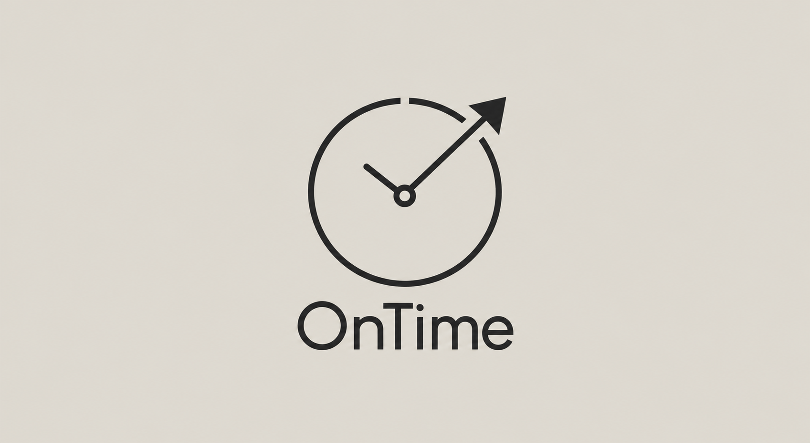

# OnTime

Projet d'application Android de prochains departs SNCF, RER, metro et tramway,
avec widget, rappels de depart et identite visuelle e-paper.

## Cible et code source

Cible : Android, developpe et teste sous Linux. Aucun ESP32, Arduino, firmware
ni ecran physique dans le build, la CI ou l'architecture active.

- `core-domain/` : domaine Kotlin pur (departs, dates, profils) et ses tests.
- `app/` : application Android Compose.
- `archive/gadgettech/` : sources GadgetTech conservees comme reference
  historique, ni compilees ni testees ([detail](archive/gadgettech/README.md)).

Voir [plan](docs/ANALYSE_ET_PLAN.md) et [audit amont](docs/AUDIT_AMONT.md).
Cles d'API et fournisseurs : [API_KEYS.md](docs/API_KEYS.md).

## Application Android de demonstration

La premiere application Compose fonctionne uniquement sur fixtures locales,
clairement marquees comme demonstration. Elle expose les quatre etats du domaine
sans API, widget ni notification. Les commandes, versions et limites sont dans
le [guide Android](docs/ANDROID_BUILD.md).

Les [profils locaux](docs/PROFILES.md) permettent de conserver arrêt, ligne,
direction, marche et marge, puis de calculer l'heure de départ de chez soi sur
les fixtures de démonstration.

## Logo

Le PNG fourni est conserve sans modification. Le SVG contient ce meme PNG
integre, sans changement de traces, police, couleurs, cadrage ou proportions.
Il s'agit d'un conteneur SVG fidele, pas d'une vectorisation en courbes.
La version redessinee precedente n'est plus le logo du projet.
La police du PNG n'est pas identifiee : ne pas la remplacer par DejaVu Sans
et ne pas annoncer une police UI equivalente comme identique.

Palette UI demandee : #ddd9d0 et #282828.

## Provenance

Source : https://github.com/Volko61/GadgetTech
Revision importee : 24b2a7ec156e6b9e76fddd42235fca424f2177c7.
Depot independant; verifier les droits amont avant redistribution.

## Travail avec Claude et Codex

Lire [AGENTS.md](AGENTS.md), [CLAUDE.md](CLAUDE.md),
[workflow](docs/AGENT_WORKFLOW.md) et [politique Git](docs/GIT_POLICY.md).
Skills canoniques dans `.agents/skills`, miroirs dans `.claude/skills`.
Contexte commun : [PROJECT_CONTEXT.md](docs/PROJECT_CONTEXT.md).
Plan a cases : [TODO.md](TODO.md).
